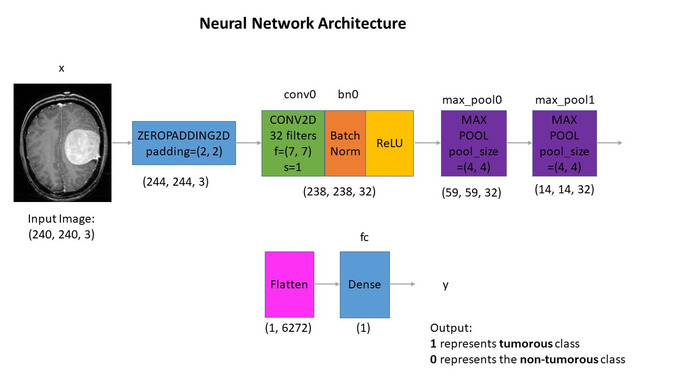

# Brain Tumor Detection Using CNN

This project involves developing a brain tumor detection model utilizing a convolutional neural network built with TensorFlow and Keras. The model is trained on brain MRI images sourced from Kaggle, available here: [Brain MRI Images Dataset](https://www.kaggle.com/navoneel/brain-mri-images-for-brain-tumor-detection).

## Dataset Details

The dataset consists of two main folders:  
- **yes**: Contains 155 MRI scans showing presence of brain tumors  
- **no**: Contains 98 MRI scans without tumors  

In total, there are 253 MRI images across both categories.

---

## Getting Started

> **Note:** GitHub’s default viewer might not properly render Jupyter notebooks. For a better experience, consider using [nbviewer](https://nbviewer.jupyter.org/) to open the notebooks.

---

## Data Augmentation

**Why augment data?**  
The dataset is relatively small and imbalanced, with fewer samples for non-tumorous cases. To address this and help the model generalize better, data augmentation techniques were applied.

- Original dataset: 155 tumor-positive and 98 tumor-negative images (253 total)  
- After augmentation: 1085 tumor-positive and 980 tumor-negative images (2065 total), including the original images  

The augmented images are saved in the folder named `augmented data`.

More details can be found in the "Data Augmentation" notebook.

---

## Preprocessing Steps

Each MRI image undergoes the following preprocessing before being fed into the network:

1. Crop the image to focus only on the brain region, removing unnecessary background.  
2. Resize all images to a uniform shape of (240, 240, 3) to ensure consistency.  
3. Normalize pixel intensities to values between 0 and 1 to facilitate better training performance.

---

## Dataset Splitting

The dataset was partitioned as follows:

- 70% for training  
- 15% for validation  
- 15% for testing  

---

## Neural Network Design

Below is the architecture implemented:



### Architecture Explanation:

Input images of shape (240, 240, 3) pass through:

1. Zero Padding layer with pool size (2, 2)  
2. Convolutional layer with 32 filters, each of size (7, 7), stride 1  
3. Batch Normalization layer to accelerate and stabilize training  
4. ReLU activation layer  
5. Max Pooling layer with filter size 4 and stride 4  
6. Another Max Pooling layer with filter size 4 and stride 4  
7. Flatten layer to convert 3D features into 1D vector  
8. Dense output layer with one neuron and sigmoid activation for binary classification  

### Reasoning Behind This Architecture:

Initial attempts with transfer learning models like ResNet50 and VGG16 led to overfitting due to limited data and resource constraints (training was done on a 6th gen Intel i7 with 8GB RAM). Instead, a simpler CNN architecture was designed and trained from scratch, which yielded effective results with manageable computational demand.

---

## Model Training

The model was trained over 24 epochs. Loss and accuracy progressions during training are shown below:

  
  

The highest validation accuracy was observed on epoch 23.

---

## Evaluation and Results

The best performing model achieved:  

- **Test Accuracy:** 88.7%  
- **Test F1 Score:** 0.88  

Given the balanced nature of the dataset, these results demonstrate solid performance.

| Metric   | Validation Set | Test Set |
| -------- | -------------- | -------- |
| Accuracy | 91%            | 89%      |
| F1 Score | 0.91           | 0.88     |

---

## Additional Information

What’s included in this repository?

- Jupyter notebooks containing all code and experiments.  
- Model weights saved as `.model` files, with the best model named `cnn-parameters-improvement-23-0.91.model`.  
- Original dataset in the `yes` and `no` folders.  
- Augmented dataset in the `augmented data` folder.

You can load the best saved model using the following code snippet:

```python
from tensorflow.keras.models import load_model

best_model = load_model('models/cnn-parameters-improvement-23-0.91.model')
